# Learning to Learn

In Chapter 1, we built a template matcher that classified handwritten digits with about 81% accuracy. It worked by averaging all training images of each digit and comparing new images to those averages. We got an approximation of the target function, but there was nothing to improve. The templates were just averages: you compute them once, and that's your model.

The template matcher performs the task, but it isn't learning. It compresses 60,000 training images into ten blurry averages and throws away everything else. There are no adjustable parts, no way to measure a mistake and correct for it. Remember what learning looks like: you try something, find out how wrong you were, adjust, and repeat.

We need a model that does the same thing. That's what this chapter builds. The ideas here (gradient descent, backpropagation, the training loop) are not specific to neural networks. They are the engine behind almost every model trained today, from the simplest logistic regression to the largest language models.

## The Optimization Loop

Chapter 1 ended with two things: a model that makes predictions ($g$) and a loss function that measures how wrong those predictions are. For classification, we used accuracy. For regression, we introduced MSE:

$$\text{MSE} = \frac{1}{N} \sum_{i=1}^{N} (g(x_i) - y_i)^2$$

We said the goal of learning is to find the $g$ that makes the loss as small as possible. But we never said *how*. The template matcher didn't minimize anything. It computed averages, and the averages were what they were.

Now suppose our model has adjustable parameters: numbers we can change that affect the model's predictions. Call them **weights**. For example, instead of averaging pixels, we could try a model as simple as a line:

$$g(x) = wx + b$$

Two weights: $w$ (the slope) and $b$ (the intercept). Change $w$ and the line tilts. Change $b$ and it shifts up or down. Different values of $w$ and $b$ produce different predictions, which produce different losses. The learning problem becomes: find the weights that minimize the loss.

Say we have three data points: $(-1, 1)$, $(0, 3)$, $(1, 5)$. If we set $w = 1, b = 0$, our model predicts $-1, 0, 1$, and the MSE is $\frac{1}{3}[(-1-1)^2 + (0-3)^2 + (1-5)^2] = 9.67$. If we try $w = 2, b = 3$, the predictions are $1, 3, 5$, and the MSE is 0. That second guess nailed it.

Now picture trying every possible combination of $w$ and $b$. Each combination gives one number: the loss. Plot $w$ on one axis, $b$ on the other, and the loss as height. You get a surface, a landscape where high terrain means bad predictions and low valleys mean good ones. Somewhere in that landscape is the point where $w = 2, b = 3$, sitting at the bottom of a valley at height zero.

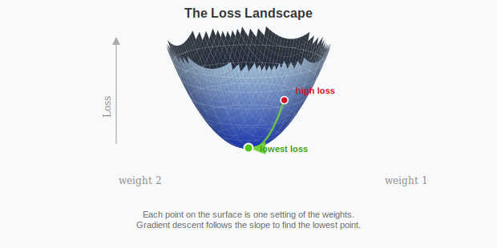

This is an **optimization** problem: find the values of the weights that make the loss as small as possible. With two weights, you can visualize the whole surface. In practice, models have millions of weights and you can't see the landscape at all. But you can check the slope where you're standing and figure out which direction is downhill. Take a step that way. Check again. Repeat.

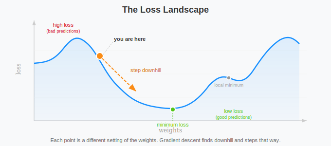

The process has three parts that repeat in a loop. First, make predictions with the current weights (the **forward pass**). Second, measure how wrong the predictions are (the **loss**). Third, adjust the weights to reduce the loss (the **update**). Every machine learning model you'll encounter in this book follows this loop. The models differ in architecture and the loss functions differ in what they measure, but the loop is always the same.

Before we can build this loop, we need to solve a specific problem: standing at some point in the loss landscape, how do we figure out which direction is downhill?

## Gradient Descent

Start with the simplest case. You have one weight $w$, and the loss is $L(w) = (w - 3)^2$. This is a parabola with its minimum at $w = 3$. If you could plot it, you'd see the bowl shape immediately and walk to the bottom. But in real models, you have millions of weights and can't visualize the surface. You need a method that works locally: check the slope where you're standing and step downhill.

The slope of a function at a point is its **derivative**. For our parabola, $\frac{dL}{dw} = 2(w - 3)$. A positive derivative means the function is increasing (you should move left, toward smaller $w$). A negative derivative means it's decreasing (move right). Zero means you might be at the bottom.

The update rule follows: move $w$ in the direction opposite to the derivative, by some step size $\eta$ called the **learning rate**.

$$w_{\text{new}} = w - \eta \frac{dL}{dw}$$

Let's trace this with actual numbers. Start at $w = 0$, with a learning rate $\eta = 0.1$:

$$\frac{dL}{dw}\bigg|_{w=0} = 2(0 - 3) = -6 \quad \Rightarrow \quad w = 0 - 0.1 \times (-6) = 0.6$$

The derivative is $-6$ (steep downhill slope to the right), so we take a big step right to $w = 0.6$. Next step:

$$\frac{dL}{dw}\bigg|_{w=0.6} = 2(0.6 - 3) = -4.8 \quad \Rightarrow \quad w = 0.6 - 0.1 \times (-4.8) = 1.08$$

Still moving right, but the step is smaller because the slope is less steep. After a few more steps: $w = 1.46$, then $1.77$, then $2.02$, each step smaller as we approach the minimum. After 20 steps, $w \approx 2.98$, nearly at the bottom. The loss went from $L(0) = 9$ down to $L(2.98) = 0.0004$.

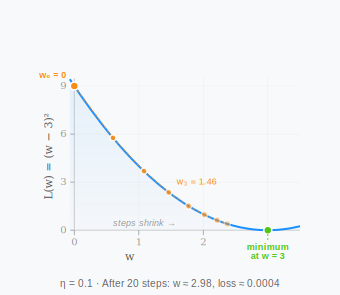

Notice that the steps were large when the slope was steep (far from the minimum) and small when the slope was gentle (near the minimum). This is automatic and it's actually good for us, we don't want to overshoot and miss the minimum.

The learning rate $\eta$ controls the overall scale. If we'd used $\eta = 0.01$, each step would be ten times smaller and we'd need 200 steps instead of 20. If we'd used $\eta = 1.0$, the first step would be $w = 0 - 1.0 \times (-6) = 6$, overshooting past the minimum to $w = 6$, and the next step would bounce back to $w = 0$, oscillating forever without converging. Too large and we overshoot. Too small and we crawl. Picking a good learning rate is a real practical challenge of training, and it's often another thing for us to try several values and see what sticks.

Now extending this to multiple weights: a real model has thousands or millions of weights: $w_1, w_2, \ldots, w_n$. The loss $L(w_1, w_2, \ldots, w_n)$ is a function of all of them. Instead of a single derivative, we compute a **gradient**: a vector of partial derivatives, one per weight.

$$\nabla L = \left[\frac{\partial L}{\partial w_1}, \frac{\partial L}{\partial w_2}, \ldots, \frac{\partial L}{\partial w_n}\right]$$

Each partial derivative $\frac{\partial L}{\partial w_i}$ answers: "if I nudge just this one weight, holding all others fixed, how does the loss change?" The gradient vector points in the direction of steepest *increase*. We want to go the opposite way, so we subtract it:

$$\mathbf{w} \leftarrow \mathbf{w} - \eta \nabla L$$

With two weights, the loss surface is a 3D landscape (two weight axes plus the height). Looking down from above, you'd see contour lines, like a topographic map. The gradient at any point is perpendicular to the contour lines, pointing uphill. We step in the opposite direction, cutting across contours toward the valley.

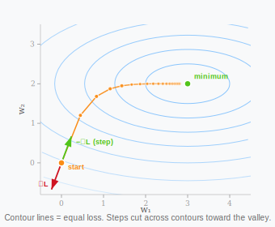

This is **gradient descent** [@cauchy1847methode]. Compute the gradient, then take a step opposite to it, and repeat. Each step reduces the loss (if the learning rate isn't too large), and over many steps the weights converge toward values that make the model's predictions good.

There's a practical issue: computing the loss over the entire training set (all 56,000 images, for instance) for every single step is computationally expensive. Instead, we can compute the loss and gradient on a small random subset called a **mini-batch** (typically 32 to 256 examples). The gradient from a mini-batch is noisier than the true gradient, but it's not biased in any direction.

The reason is straightforward: the full gradient is the average of per-example gradients across all 56,000 images; a random mini-batch of 64 is a random sample from those 56,000, and the average of a random sample is an unbiased estimator of the population average:

$$E[\nabla L_{\text{batch}}] = \nabla L_{\text{full}}$$

On any single batch the gradient might be off, but across batches it's exactly right on average. We can take many more steps in the same time, and the noise turns out to help: it prevents the optimizer from settling into sharp, narrow valleys that happen to fit the training data but don't generalize. This variant is called **stochastic gradient descent** (SGD), and it's what virtually every modern model uses (with some variations).

The loss landscape has valleys, ridges, and plateaus. There might be multiple valleys (multiple settings of the weights that give low loss), and there's no guarantee gradient descent finds the deepest one. In one dimension, this is a real worry. A loss curve with two dips can trap you in the shallow one: you walk downhill, reach the bottom, and stop. The gradient is zero, so you have no direction to move. You're stuck in a **local minimum**, even though a deeper minimum exists somewhere else.

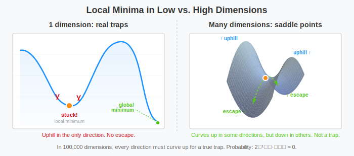

In high dimensions, something that helps us happens: local minima are **really** rare.

To understand why, think about what a local minimum requires. At a critical point (where the gradient is zero), the loss surface curves in every direction. A local minimum needs the surface to curve *upward* in every single direction; it's a bowl. A **saddle point** curves up in some directions and down in others; it's shaped like a mountain pass, or a horse saddle.

In one dimension, a critical point has one direction. It either curves up (minimum) or down (maximum). Roughly a coin flip. In two dimensions, both directions must curve up for a minimum: two coin flips, both heads. The probability drops to 25%. In general, for a critical point in $n$ dimensions to be a local minimum, all $n$ directions must curve upward. The probability of this is roughly:

$$P(\text{local minimum}) \approx \frac{1}{2^n}$$

A simple neural network for MNIST has around 100,000 weights: 100,000 directions. The chance that all of them curve upward simultaneously is $2^{-100{,}000}$, a number so small that picking a specific atom out of all atoms in the universe is trillions of trillions of times more likely. Almost every critical point in the loss landscape is a saddle point, not a local minimum [@dauphin2014identifying].

| Dimensions | Directions that must curve up | Probability of local min |
|------------|-------------------------------|--------------------------|
| 1          | 1                             | ~50%                     |
| 2          | 2                             | ~25%                     |
| 10         | 10                            | ~0.1%                    |
| 100        | 100                           | $2^{-100} \approx 10^{-30}$ |
| 100,000    | 100,000                       | effectively 0            |

And saddle points aren't traps. They have at least one direction that curves downward: an escape route. Gradient descent follows that escape, and so does the stochastic version (SGD).

What about the astronomically rare local minima that *do* exist? They tend to be nearly as good as the global minimum [@choromanska2015loss]. The intuition: for a critical point to have both high loss *and* all directions curving upward, the landscape must be unusually pathological. The higher the loss, the more directions are available to curve downward, making saddle points even more likely. Local minima cluster near the bottom of the loss landscape, where they're hardly worse than the global minimum. Getting "stuck" in one of these is less like falling into a pit and more like stopping on one of many nearly identical valley floors.

This is why gradient descent works in practice despite the loss landscape having no obvious structure. The geometry of high-dimensional space works in our favor: the higher the dimension, the fewer traps exist, and the ones that remain are shallow.

We now know how to find the best weights models: compute gradients, step downhill, repeat. But so far our model $g(x) = wx + b$ outputs a raw number; it could be 3.7, or −12, or a million. That's fine for regression, where you're predicting a quantity. For classification, we need something different: an output we can read as "how confident is the model that this is a 7?" We need a way to squeeze that raw number into a probability.

## The Perceptron

In 1958, Frank Rosenblatt introduced the perceptron [@rosenblatt1958perceptron]: a single unit that takes a vector of numbers as input and produces a single number as output.

What it computes is: take the input vector $x = [x_1, x_2, \ldots, x_d]$ (for MNIST, that's 784 pixel values); multiply each input by a corresponding weight, add them all up, and add a bias term:

$$z = w_1 x_1 + w_2 x_2 + \cdots + w_d x_d + b = \mathbf{w} \cdot \mathbf{x} + b$$

This should look familiar: it's a dot product (the same operation from Euclidean distance and template matching in Chapter 1) plus a bias. The weights $\mathbf{w}$ and bias $b$ are the learnable parameters, the numbers that gradient descent will adjust.

The result $z$ can be any real number. To turn it into a prediction, we pass it through an **activation function** $\sigma$:

$$\hat{y} = \sigma(z) = \sigma(\mathbf{w} \cdot \mathbf{x} + b)$$

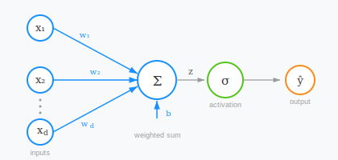

For binary classification (yes or no, dog or cat), the classic choice is the **sigmoid function**:

$$\sigma(z) = \frac{1}{1 + e^{-z}}$$

This squashes any real number into the range $(0, 1)$. Large positive values of $z$ get mapped close to 1. Large negative values get mapped close to 0. The output can be interpreted as a probability: "the model is 87% confident this is a dog."

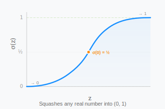

Now think geometrically about what a perceptron does. If the input is two-dimensional, the equation $w_1 x_1 + w_2 x_2 + b = 0$ defines a line in the plane. Everything on one side of the line (where the weighted sum is positive) gets classified as 1. Everything on the other side gets classified as 0. The weights control the orientation of the line. Changing $w_1$ and $w_2$ tilts it; changing $b$ slides it sideways. Gradient descent adjusts these values until the line best separates the two classes.

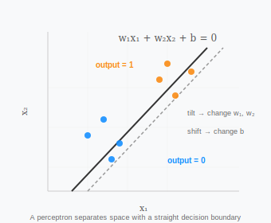

In higher dimensions, the line becomes a **hyperplane**: a flat boundary that divides the space in half. With 784-dimensional pixel inputs, the perceptron draws a 783-dimensional hyperplane through pixel space. Everything on one side is "this digit," everything on the other side is "not this digit."

How well does this work for handwritten digits? If you train 10 separate perceptrons (one per digit class, each deciding "is this the digit x or not"), you get a **linear classifier**. Each perceptron draws its own hyperplane, and we can say that the prediction is whichever perceptron scores highest. Train it with gradient descent on MNIST and you can get about 92% accuracy. That's a meaningful jump from the template matcher's 81%, and it makes sense: the template matcher used fixed averages, while the linear classifier *optimized* its boundaries. The weights aren't just averages of examples; they're the boundaries that gradient descent found to best separate the classes, it captures a lot more nuance.

But 92% is still a ceiling. Since the perceptron computes $z = \mathbf{w} \cdot \mathbf{x} + b$ and classifies based on the sign of $z$, its decision boundary is the set of points where $\mathbf{w} \cdot \mathbf{x} + b = 0$: an $(n-1)$-dimensional hyperplane in $n$-dimensional space. It can only classify data that is **linearly separable**: two sets of points $X_0$ and $X_1$ in $\mathbb{R}^n$ are linearly separable if there exist $w_1, w_2, \ldots, w_n$ and $k$ such that every point $\mathbf{x} \in X_0$ satisfies $\sum_{i=1}^{n} w_i x_i > k$ and every point $\mathbf{x} \in X_1$ satisfies $\sum_{i=1}^{n} w_i x_i < k$. If your data can be split by a flat boundary, a perceptron will find it. If it can't, no amount of training will help.

Look at the confusion matrix and you'll see the same problem as Chapter 1: 4s confused with 9s, 3s confused with 5s and 8s; the geometry tells you why it can't capture harder patterns. A 4 and a 9 have a very similar vertical stroke on the right side; in pixel space, these digits overlap: there's no single flat cut through 784-dimensional space that cleanly separates all 4s from all 9s. The hyperplane does the best it can, but the best straight boundary through a curved overlap is still not enough.

Let's think of a simpler problem. The logical disjunction or exclusive or (XOR) takes two binary inputs and returns 1 when exactly one is 1 (given the propositions p and q, p or q assumes the value false if and only if p and q are both false):

| $x_1$ | $x_2$ | XOR |
|--------|--------|-----|
| 0 | 0 | 0 |
| 0 | 1 | 1 |
| 1 | 0 | 1 |
| 1 | 1 | 0 |

Now the question: can we represent XOR with the perceptron model? Plot these four points: the 1s sit at opposite corners of the square. The representation we need is one that successfully separates `true` (1) and `false` (0).

Since this is a two-dimensional space, the perceptron representation would be a line; we can prove directly that no such line exists. For the perceptron to classify XOR correctly, we need $\sigma(z) > 0.5$ for the 1s and $\sigma(z) < 0.5$ for the 0s, which means $z = w_1 x_1 + w_2 x_2 + b$ must be positive for the 1s and negative for the 0s. Writing out the four constraints:

- $(0, 0) \to 0$: $b < 0$
- $(0, 1) \to 1$: $w_2 + b > 0$
- $(1, 0) \to 1$: $w_1 + b > 0$
- $(1, 1) \to 0$: $w_1 + w_2 + b < 0$

Adding the second and third inequalities gives $w_1 + w_2 + 2b > 0$, but the fourth requires $w_1 + w_2 + b < 0$. Subtracting the fourth from the sum: $b > 0$. This contradicts the first constraint. No values of $w_1, w_2, b$ satisfy all four conditions simultaneously.

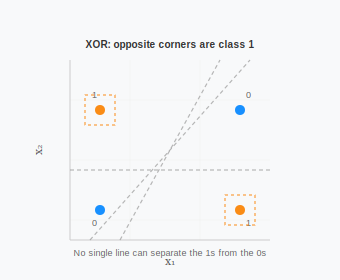

You can try to draw a single line that separates the 1 from the 0s as much as you want; it isn't possible. No matter how you tilt or slide the line, at least one point ends up on the wrong side.

The data isn't linearly separable: no flat boundary can sort it correctly. Digits aren't as clean as XOR's four points, but the same principle applies. Some regions of pixel space contain a mix of 4s and 9s that no hyperplane can untangle.

A perceptron can't solve XOR, and it can't cleanly separate 4s from 9s. One straight boundary isn't enough. The natural next question: what if we combine multiple perceptrons, each drawing its own boundary? Could several lines working together separate regions that no single line can?

There's a classical solution to this. If the data isn't separable in the space you're working in, move it to a space where it is. Take our four XOR points. No line separates them in 2D. But what if we add a third coordinate, $x_3 = x_1 \cdot x_2$?

| $x_1$ | $x_2$ | $x_1 \cdot x_2$ | XOR |
|--------|--------|----------|-----|
| 0 | 0 | 0 | 0 |
| 0 | 1 | 0 | 1 |
| 1 | 0 | 0 | 1 |
| 1 | 1 | 1 | 0 |

The class-1 points both have $x_3 = 0$. The class-0 point at $(1,1)$ has $x_3 = 1$. A flat plane in this 3D space can now cut between them. We didn't change the data; we created a new feature that made the structure visible to a linear boundary.

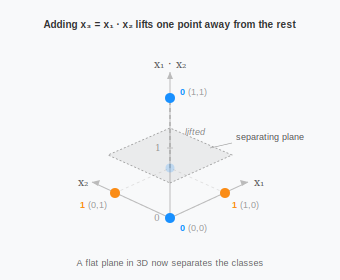

This is the idea behind **support vector machines** (SVMs) [@cortes1995support]: pick a function (called a *kernel*) that transforms the data into a higher-dimensional space, then find the best hyperplane there. It works, and for decades it was the dominant approach. But notice the catch: *you* have to choose the right kernel. The transformation is fixed before training starts. If you pick a kernel that doesn't capture the right structure, the SVM can't recover. For XOR, $x_1 \cdot x_2$ was obvious. For 784-dimensional images of handwritten digits, the right transformation is not obvious at all.

We're going to take a different path. Instead of choosing the transformation by hand, we'll make it part of the model and let the training process figure it out. That's what the hidden layer does, and it's what we'll build next.

## From Perceptions to Neural Networks

We can start combining them by considering what happens if we skip the activation function entirely. The perceptron computes $z = \mathbf{w} \cdot \mathbf{x} + b$, a linear function of the input, now let's stack two of these: The first layer produces $z_1 = \mathbf{w}_1 \cdot \mathbf{x} + b_1$. The second layer takes that as input:

$$z_2 = \mathbf{w}_2 \cdot z_1 + b_2 = \mathbf{w}_2 \cdot (\mathbf{w}_1 \cdot \mathbf{x} + b_1) + b_2 = (\mathbf{w}_2 \mathbf{w}_1) \cdot \mathbf{x} + (\mathbf{w}_2 b_1 + b_2)$$

The result is still a linear function of $\mathbf{x}$, the two layers are equivalent to just one. You could stack a hundred linear layers and get the same thing: a single linear transformation. No matter how many perceptrons you combine, a linear function of a linear function is just another linear function. A hundred hyperplanes that all combine linearly just produce one hyperplane; you never escape the limits of a straight boundary.

What if we inserted something nonlinear between the layers: a function that bends the output before passing it to the next layer? Then the composition wouldn't collapse, because a nonlinear function of a linear function isn't linear anymore. Each layer could bend and reshape the space in ways that a linear function can't.

Think about what happens geometrically: without activation functions, each layer can only rotate, scale, and shift the data, operations that preserve straight lines. A square grid of points stays a (possibly rotated) grid after a linear transformation, but add a nonlinear activation between layers, and the layer can fold the space; crease it along a boundary so that what was a straight line becomes bent. Stack enough of these folds, and you can carve the space into a lot more complex regions.

Actually, in 1989, George Cybenko [@cybenko1989approximation] proved this. A single layer of perceptrons with a nonlinear activation, feeding into one more perceptron, can approximate any continuous function to any desired accuracy, given enough perceptrons in that layer. This is the **universal approximation theorem**: the architecture doesn't limit *what* the model can represent, only how efficiently it does so. In principle, one layer of enough perceptrons can learn anything. In practice, "enough" might mean an absurd number, but this doesn't even take stacking more layers into account.

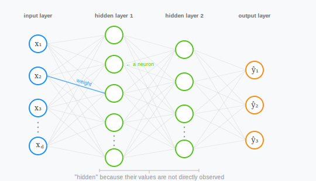

This structure, layers of perceptrons feeding into each other with nonlinear activations between them, is a **neural network**. The name comes from a loose analogy to biology: the brain is made up of billions of interconnected cells called neurons. Each neuron receives electrical signals from other neurons, and if the combined input is strong enough, it fires and sends its own signal onward. The perceptron mirrors this at a very abstract level: it takes weighted inputs, sums them, and "activates" if the result crosses a threshold. The analogy shouldn't be taken too far, but the core idea, many simple units wired together so that each one's output becomes another's input, was enough to inspire the field. The terminology stuck: each perceptron in a network is called a **neuron**, a layer of neurons between the input and the output is a **hidden layer** (hidden because you don't observe its values directly), and the full stack is a **neural network**.

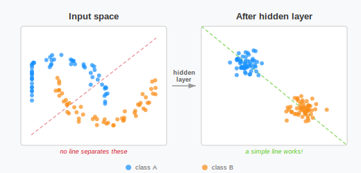

The **width** of a layer is the number of neurons in it. The **depth** of a network is how many layers it has. A network with one hidden layer of 128 neurons and an output layer of 10 is a 2-layer network (we don't count the input layer, since it just passes data through). A network with many hidden layers is called a **deep network**, and training such networks is called **deep learning**. The total number of weights is what determines the network's size: a hidden layer connecting 784 inputs to 128 neurons has $784 \times 128 + 128 = 100{,}480$ weights (plus 128 biases, one per neuron). A network with more weights can represent more complex functions (but also needs more data to learn the representation well).

One neuron might not help much, but 128 neurons in a hidden layer, each folding along a different hyperplane, can origami the space into something very different. After enough folds, the XOR points that no single line could separate end up neatly on one side of a new, simple boundary.

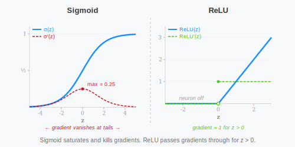

The **sigmoid** we already saw is one choice of activation:

$$\sigma(z) = \frac{1}{1 + e^{-z}}$$

It was the default for decades, but it has a problem in deep networks. Look at the sigmoid curve: when $z$ is very large or very small, the curve is nearly flat. Flat means the gradient is close to zero. To update an early layer's weights, the gradient signal has to travel back through every layer between it and the output, and at each layer it gets multiplied by the local gradient. If that local gradient is small (because the sigmoid is in its flat region), the signal shrinks. The derivative of sigmoid is $\sigma(z)(1 - \sigma(z))$, which peaks at just 0.25 and drops rapidly in both directions. Multiply several of these together and the gradient becomes exponentially small by the time it reaches the first layers. This is the **vanishing gradient** problem: early layers stop learning because the gradient that reaches them is too small to make meaningful updates.

The modern default is **ReLU** (Rectified Linear Unit) [@nair2010rectified]:

$$\text{ReLU}(z) = \max(0, z)$$

Negative inputs become 0, positive inputs pass through unchanged. The derivative is 1 for positive inputs (the gradient flows through without shrinking) and 0 for negative inputs (the neuron is "off"). ReLU avoids the vanishing gradient problem for positive inputs and is faster to compute than sigmoid. This is the "fold" from our geometric picture: ReLU creases the space along the hyperplane where the neuron's input is zero.


There are other activation functions (tanh, Leaky ReLU, GELU), each with tradeoffs, but the intuition is the same for all of them: insert nonlinearity between layers so the network can warp the space rather than merely rotating it. For this chapter, we'll use ReLU for hidden layers and a different function (softmax) for the output.

## The Forward Pass

Let's put this together for our digit classifier. The input is a 784-dimensional vector (a flattened 28×28 image). The output should be 10 numbers, one per digit class. We'll put one hidden layer of 128 neurons in between.

Each of the 128 hidden neurons receives all 784 inputs, multiplies them by its own weights, adds a bias, and applies ReLU. We can write all 128 neurons at once using matrix multiplication. Stack the 128 weight vectors into a matrix $W_1$ of shape $128 \times 784$, and the 128 biases into a vector $b_1$ of length 128:

$$h = \text{ReLU}(W_1 x + b_1)$$

The matrix multiply $W_1 x$ computes all 128 dot products simultaneously, adding $b_1$ shifts each one. ReLU zeros out the negatives, and the result $h$ is a 128-dimensional vector: the hidden layer's output.

This vector $h$ is a completely new representation of the input. The raw pixels are the same for every task: a photo of a digit or a photo of a face all have the same pixel structure, but $h$ is task-specific. It's been shaped by training to highlight exactly the features that distinguish one digit from another. If the network learned that "there's a loop in the upper half" matters for distinguishing 8 from 1, some neurons in $h$ will fire strongly when a loop is present and stay quiet when it's not. The network isn't working with raw pixels anymore; it's working with a learned vocabulary of visual features.


The linear classifier couldn't separate 4s from 9s because those digits overlap in pixel space, but in the hidden space $h$, after the nonlinear transformation, the network can *pull them apart*. The 128-dimensional space that $h$ lives in is a space the network designed (through training) specifically so that digits that were tangled in pixel coordinates end up in separate regions. We'll see this directly in the hands-on when we visualize the hidden representations.

The 10 output neurons each receive all 128 hidden values, multiply by their own weights, and add a bias. In matrix form, with $W_2$ of shape $10 \times 128$ and $b_2$ of length 10:

$$z = W_2 h + b_2$$

The result is 10 raw scores, one per digit class. These aren't probabilities yet (they can be any real number). To turn them into probabilities, we apply the **softmax** activation function:

$$\text{softmax}(z)_i = \frac{e^{z_i}}{\sum_{j=1}^{10} e^{z_j}}$$

Softmax exponentiates each score (making them all positive) and divides by the total (making them sum to 1). It's the natural choice for turning scores into probabilities: always positive, always sums to 1, and it preserves the ordering of the original scores (the highest score always gets the highest probability). The output is a probability distribution: "32% chance it's a 3, 61% chance it's an 8, ..." The predicted class is the one with the highest probability.

One caveat: these numbers look like probabilities, and we'll treat them that way, but they're not necessarily well-calibrated: a model that outputs 0.9 for a digit might only be right 75% of the time when it says that. Neural networks tend to be overconfident; the relative ordering is reliable (higher scores mean the model is more sure), but the absolute numbers shouldn't be trusted as literal frequencies.

The entire computation from input to prediction is the **forward pass**:

$$x \xrightarrow{W_1, b_1} \text{ReLU}(W_1 x + b_1) = h \xrightarrow{W_2, b_2} \text{softmax}(W_2 h + b_2) = \hat{y}$$

The hidden layer transforms the input from a space where digits overlap into a space where they're separable. The output layer draws hyperplanes through the hidden space, which works now because the hidden layer already untangled the data. This is why the neural network beats the linear classifier. The linear classifier draws hyperplanes directly through pixel space, where the data is tangled; the neural network first untangles the data, then draws the hyperplanes.

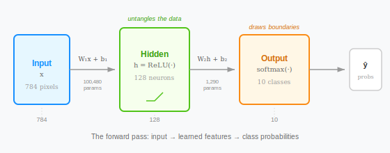

The forward pass is just matrix multiplies, additions, and element-wise nonlinear functions. What makes neural networks powerful is the ability to *adjust the weights* to make this forward pass produce better predictions. For that, we need to figure out how each weight contributes to the loss.

We need a loss function suited for classification into multiple categories. In Chapter 1, we introduced MSE for regression. MSE can technically be used for classification too, but it treats all wrong answers proportionally: a prediction of 0.4 for the correct class is "a little wrong" and gets a gentle nudge. For classification, we want the model to be punished sharply for assigning low probability to the right answer. **Cross-entropy loss** does this.

If the true label is digit $k$ (represented as a one-hot vector $y$ with a 1 at position $k$ and 0s elsewhere), and the model outputs probabilities $\hat{y}$:

$$L = -\sum_{i=0}^{9} y_i \log(\hat{y}_i) = -\log(\hat{y}_k)$$

Since $y$ is one-hot, only the term where $y_i = 1$ survives. The loss is the negative log of the probability assigned to the correct class. If the model is confident and right ($\hat{y}_k$ close to 1), $-\log(1) = 0$: no loss. If the model assigns low probability to the correct answer ($\hat{y}_k$ close to 0), $-\log(\hat{y}_k)$ shoots toward infinity.

There's another way to read this curve: think of $-\log(p)$ as measuring surprise. If the model assigns 95% to the correct class, it's not surprised when that class shows up: low loss. If it assigns 1%, it's very surprised: high loss. Cross-entropy is the model's average surprise across the training set. A perfect model is never surprised, but a bad model is constantly surprised. This is why cross-entropy is the standard for classification: it directly measures how far the model's beliefs are from reality.


The forward pass is just matrix multiplies, additions, and element-wise nonlinear functions. What makes neural networks powerful is the ability to adjust the weights to make this forward pass produce better predictions. We already know the recipe: compute the gradient of the loss with respect to every weight, then step downhill. But in a network with multiple layers, the loss doesn't depend on the first layer's weights directly; it depends on them through every layer that comes after. We need a way to trace that chain of dependencies backward.

## Backpropagation

The chain rule from calculus solves this directly. If the loss depends on $w_1$ through a sequence of intermediate values, we can compute $\partial L / \partial w_1$ by multiplying the local derivatives along that sequence. The math is easier to see at small scale, so before we tackle the full digit classifier, let's trace the gradients through the smallest possible neural network: one input, one hidden neuron, one output. Small enough to compute everything by hand.

The network takes a single number $x$ as input, passes it through a hidden neuron with ReLU, and produces a prediction $\hat{y}$. We'll use squared error as the loss: $L = (\hat{y} - y)^2$.

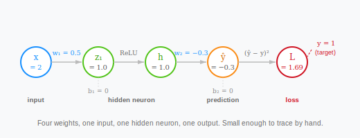

Set the input $x = 2$, the target $y = 1$, and initialize the weights: $w_1 = 0.5$, $b_1 = 0$, $w_2 = -0.3$, $b_2 = 0$. First, the forward pass. Each step feeds into the next:

$$z_1 = w_1 x + b_1 = 0.5 \times 2 + 0 = 1.0$$

$$h = \text{ReLU}(z_1) = \text{ReLU}(1.0) = 1.0$$

$$\hat{y} = w_2 h + b_2 = -0.3 \times 1.0 + 0 = -0.3$$

$$L = (\hat{y} - y)^2 = (-0.3 - 1)^2 = 1.69$$

The prediction is $-0.3$, the target is $1$, and the loss is $1.69$. Now we need to adjust the weights to bring that loss down. For each weight, we need to answer: if I nudge this weight slightly, how does the loss change? That's the gradient, and we compute it by working backward through the chain.

Start at the end. How does the loss change when the prediction $\hat{y}$ changes?

$$\frac{\partial L}{\partial \hat{y}} = 2(\hat{y} - y) = 2(-0.3 - 1) = -2.6$$

The negative sign tells us: increasing $\hat{y}$ would decrease the loss. That makes sense. The prediction is $-0.3$ and the target is $1$, so we want $\hat{y}$ to go up.

Now, how does $\hat{y}$ change when $w_2$ changes? Since $\hat{y} = w_2 h + b_2$:

$$\frac{\partial \hat{y}}{\partial w_2} = h = 1.0$$

Chain them together to get the gradient of the loss with respect to $w_2$:

$$\frac{\partial L}{\partial w_2} = \frac{\partial L}{\partial \hat{y}} \cdot \frac{\partial \hat{y}}{\partial w_2} = -2.6 \times 1.0 = -2.6$$

Negative gradient: increasing $w_2$ would decrease the loss. Same logic for the bias, since $\frac{\partial \hat{y}}{\partial b_2} = 1$:

$$\frac{\partial L}{\partial b_2} = -2.6 \times 1 = -2.6$$

That handles the output layer. Now the question that makes backpropagation necessary: what about $w_1$? The loss doesn't mention $w_1$ directly. It goes through the entire chain: $w_1$ affects $z_1$, which affects $h$, which affects $\hat{y}$, which affects $L$. We need to trace that chain link by link.

How does the loss change when $h$ changes? Since $\hat{y} = w_2 h + b_2$:

$$\frac{\partial L}{\partial h} = \frac{\partial L}{\partial \hat{y}} \cdot \frac{\partial \hat{y}}{\partial h} = -2.6 \times w_2 = -2.6 \times (-0.3) = 0.78$$

Positive: increasing $h$ would increase the loss. That also makes sense: $w_2$ is negative, so a larger hidden value pushes the prediction further negative, away from the target.

How does $h$ change when $z_1$ changes? Since $h = \text{ReLU}(z_1)$ and $z_1 = 1.0 > 0$, the ReLU was active (passing the input through unchanged), so:

$$\frac{\partial h}{\partial z_1} = 1$$

And finally, how does $z_1$ change when $w_1$ changes? Since $z_1 = w_1 x + b_1$:

$$\frac{\partial z_1}{\partial w_1} = x = 2$$

Chain everything together:

$$\frac{\partial L}{\partial w_1} = \frac{\partial L}{\partial \hat{y}} \cdot \frac{\partial \hat{y}}{\partial h} \cdot \frac{\partial h}{\partial z_1} \cdot \frac{\partial z_1}{\partial w_1} = -2.6 \times (-0.3) \times 1 \times 2 = 1.56$$

And for the first bias ($\frac{\partial z_1}{\partial b_1} = 1$):

$$\frac{\partial L}{\partial b_1} = -2.6 \times (-0.3) \times 1 \times 1 = 0.78$$

Now update every weight. With a learning rate $\eta = 0.1$:

$$w_1 \leftarrow 0.5 - 0.1 \times 1.56 = 0.344$$
$$b_1 \leftarrow 0 - 0.1 \times 0.78 = -0.078$$
$$w_2 \leftarrow -0.3 - 0.1 \times (-2.6) = -0.04$$
$$b_2 \leftarrow 0 - 0.1 \times (-2.6) = 0.26$$

Did it work? Run the forward pass again with the new weights:

$$z_1 = 0.344 \times 2 + (-0.078) = 0.61$$
$$h = \text{ReLU}(0.61) = 0.61$$
$$\hat{y} = -0.04 \times 0.61 + 0.26 = 0.236$$
$$L = (0.236 - 1)^2 = 0.584$$

The loss dropped from 1.69 to 0.584. The prediction moved from $-0.3$ to $0.236$, closer to the target of 1. One step of gradient descent, and every weight shifted in the right direction. Repeat this enough times and the network converges.

That's the full picture at the smallest scale: four weights, four gradients, each computed by chaining local derivatives from output back to input. This is **backpropagation** [@rumelhart1986learning]: the algorithm that makes training deep networks practical. The name means applying the **chain rule** layer by layer from output to input. Each operation in the forward pass has a local derivative, and the chain rule says we multiply them together walking backward to get the gradient of $L$ with respect to anything.

Before we move on, notice the pattern. At each layer, we did the same thing. The gradient of a weight was always the error arriving from above times the activation coming from below: for $w_2$, error $(-2.6)$ times activation $h$ $(1.0)$ gave $-2.6$; for $w_1$, error $(0.78)$ times input $x$ $(2)$ gave $1.56$. The error flowing backward was always the error from above times the weight of the connection: for $h$, error $(-2.6)$ times weight $w_2$ $(-0.3)$ gave $0.78$. The bias gradient was the error itself, always. And the ReLU either passed the error through (if active) or blocked it (if off). Here it passed, since $\text{ReLU}'(1.0) = 1$.

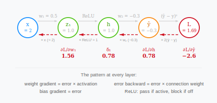

These four operations are all any layer ever does. In general: values flow forward through the network (each layer computes a weighted sum, adds a bias, applies the activation), and gradients flow backward (each layer multiplies by its local derivative and passes the result to the layer before it). The forward pass asks "what does the network predict?" The backward pass asks "how should each weight change?"

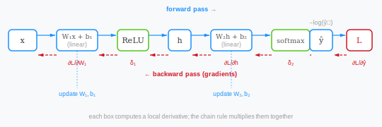

The same pattern will appear in the digit classifier, just with vectors and matrices instead of numbers.

## From Scalars to Vectors

Now we need to apply this to our digit classifier, where the input is 784 pixels instead of one number, the hidden layer has 128 neurons instead of one, and the output has 10 classes instead of one value. The computation graph is the same, the chain rule is the same, and the pattern at each layer is the same. The only thing that changes is what "multiply" means when we move from scalars to matrices.

In the scalar example, $x$ is a number, $w_1$ is a number, and $z_1 = w_1 x + b_1$ is one multiplication plus one addition. In the digit classifier, $x$ is a vector of 784 pixel values and the hidden layer has 128 neurons, each with its own set of 784 weights. We stack all those weights into a matrix $W_1$ of shape $(784 \times 128)$, where each column holds the 784 weights of one neuron:

$$W_1 = \begin{bmatrix} | & | & & | \\ w^{(1)} & w^{(2)} & \cdots & w^{(128)} \\ | & | & & | \end{bmatrix} \quad (784 \times 128)$$

To compute the activation of one neuron, we take the dot product of its 784 weights with the 784 pixels, then add its bias. That's the same $w_1 x + b_1$ from the scalar case, but with 784 terms in the sum instead of 1. To compute all 128 neurons at once, we use matrix multiplication. $W_1$ is stored as $(784 \times 128)$, with each neuron's weights in a column, but matrix multiplication needs the shared dimension on the inside: $(128 \times 784) \times (784 \times 1) = (128 \times 1)$. So we transpose $W_1$ to put each neuron's weights in a row:

$$z_1 = W_1^T x + b_1 = \underbrace{\begin{bmatrix} \text{--- } w^{(1)T} \text{ ---} \\ \text{--- } w^{(2)T} \text{ ---} \\ \vdots \\ \text{--- } w^{(128)T} \text{ ---} \end{bmatrix}}_{128 \times 784} \underbrace{\begin{bmatrix} x_1 \\ x_2 \\ \vdots \\ x_{784} \end{bmatrix}}_{784 \times 1} + \underbrace{\begin{bmatrix} b^{(1)} \\ \vdots \\ b^{(128)} \end{bmatrix}}_{128 \times 1} = \underbrace{\begin{bmatrix} w^{(1)} \cdot x + b^{(1)} \\ w^{(2)} \cdot x + b^{(2)} \\ \vdots \\ w^{(128)} \cdot x + b^{(128)} \end{bmatrix}}_{128 \times 1}$$

Row 1 times $x$ gives the dot product of neuron 1's weights with the pixels. Row 2 times $x$ gives neuron 2. And so on: 128 rows, 128 dot products in parallel. The result is a vector of 128 values, the direct analogue of the scalar $z_1 = w_1 x + b_1$ repeated 128 times.

The transpose is there to make the shapes line up: we store each neuron as a column but need it as a row for the multiplication, but it also has a geometric meaning. $W_1^T x$ is a linear transformation: it takes a point in 784-dimensional pixel space and maps it to a point in a new 128-dimensional space. Each row of $W_1^T$ defines a direction in pixel space, and the dot product measures how far the input extends along that direction. The 128 rows are 128 learned directions, and $z_1$ gives the input's coordinates in this new space. Training adjusts those directions until they capture the features that matter for telling digits apart.

ReLU applies element by element, each of the 128 values either passes (if positive) or gets zeroed (if negative). Shape doesn't change:

$$h = \text{ReLU}(z_1) = \begin{bmatrix} \text{ReLU}(z_1^{(1)}) \\ \text{ReLU}(z_1^{(2)}) \\ \vdots \\ \text{ReLU}(z_1^{(128)}) \end{bmatrix} \quad (128 \times 1)$$

The second layer does the same thing. $W_2$ is $(128 \times 10)$: 128 weights per class, 10 classes. Transpose gives $(10 \times 128)$, and each of the 10 rows does a dot product with $h$ to produce one class score:

$$z_2 = W_2^T h + b_2 \quad \underbrace{(10 \times 128)}_{W_2^T} \times \underbrace{(128 \times 1)}_{h} + \underbrace{(10 \times 1)}_{b_2} = \underbrace{(10 \times 1)}_{z_2}$$

Softmax turns the 10 scores into 10 probabilities (shape doesn't change), and cross-entropy collapses them into a single number: the loss. The full pipeline, with shapes at every stage:

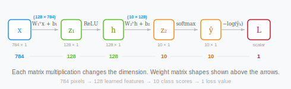

Now we trace the gradients backward, the same way we did in the scalar example. At each layer we'll compute the same four things: the weight gradient, the bias gradient, the error flowing backward, and the ReLU gate. The shapes are different, but the logic is identical.

Start at the output. In the scalar case, the error was one number: $\frac{\partial L}{\partial \hat{y}} = 2(\hat{y} - y) = -2.6$. In the digit classifier, with softmax and cross-entropy, the error is a vector of 10:

$$\delta_2 = \hat{y} - y = \begin{bmatrix} 0.05 \\ 0.02 \\ 0.03 \\ -0.39 \\ \vdots \end{bmatrix} \quad (10 \times 1)$$

One error per class. For the correct class, this is $\hat{y}_k - 1$ (the model's probability minus the target). For all other classes, it's just $\hat{y}_i$ (the probability minus zero). Softmax and cross-entropy are mathematically designed to pair together, which is why the gradient simplifies to this clean form: prediction minus target.

Now the gradient for $W_2$. In the scalar case: error times activation, $\frac{\partial L}{\partial \hat{y}} \cdot h = -2.6 \times 1.0 = -2.6$. One number times one number.

In the digit classifier, $W_2$ has 1,280 weights. Each weight $W_{2,ji}$ connects hidden neuron $j$ to output class $i$, and its gradient is the same formula: error at output $i$ times activation of neuron $j$. To compute all 1,280 gradients at once, we use the **outer product**:

$$\frac{\partial L}{\partial W_2} = h \cdot \delta_2^T = \underbrace{\begin{bmatrix} h_1 \\ h_2 \\ \vdots \\ h_{128} \end{bmatrix}}_{128 \times 1} \underbrace{\begin{bmatrix} \delta_1 & \delta_2 & \cdots & \delta_{10} \end{bmatrix}}_{1 \times 10} = \underbrace{\begin{bmatrix} h_1 \delta_1 & h_1 \delta_2 & \cdots & h_1 \delta_{10} \\ h_2 \delta_1 & h_2 \delta_2 & \cdots & h_2 \delta_{10} \\ \vdots & \vdots & \ddots & \vdots \\ h_{128} \delta_1 & h_{128} \delta_2 & \cdots & h_{128} \delta_{10} \end{bmatrix}}_{128 \times 10}$$

Every entry is error times activation, the same formula as the scalar case. The result has shape $(128 \times 10)$, matching $W_2$. The transpose on $\delta_2$ is mechanical: $h$ is a column $(128 \times 1)$ and $\delta_2$ is a column $(10 \times 1)$, and you can't multiply two columns together. Transposing $\delta_2$ into a row $(1 \times 10)$ gives $(128 \times 1) \times (1 \times 10) = (128 \times 10)$. The transpose exists to make the shapes line up for the outer product.

The bias gradient is the error itself, since the derivative of $W^T h + b$ with respect to $b$ is the identity:

$$\frac{\partial L}{\partial b_2} = \delta_2 \quad (10 \times 1)$$

Next we need to send the error backward to $h$. In the scalar case: error times weight, $-2.6 \times (-0.3) = 0.78$. The error travels backward through the same wire.

In the digit classifier, each hidden neuron $j$ is connected to all 10 outputs. The error reaching it is the sum of all 10 output errors, each weighted by the connection strength:

$$\frac{\partial L}{\partial h_j} = \sum_{i=1}^{10} W_{2,ji} \cdot \delta_{2,i}$$

That's a dot product: row $j$ of $W_2$ times $\delta_2$. To compute all 128 at once:

$$\frac{\partial L}{\partial h} = W_2 \cdot \delta_2 = \underbrace{(128 \times 10)}_{W_2} \times \underbrace{(10 \times 1)}_{\delta_2} = \underbrace{(128 \times 1)}$$

During the forward pass, $W_2^T$ with shape $(10 \times 128)$ carried 128 activations forward to 10 outputs. During the backward pass, $W_2$ with shape $(128 \times 10)$ carries 10 errors back to 128 neurons. Same wires, opposite direction.

Geometrically, the forward pass compressed 128 dimensions down to 10 by projecting onto 10 learned directions. The backward pass reverses that projection: it spreads 10 error signals back across the 128 dimensions they came from, weighted by the same connections. Every transpose in backpropagation has this same explanation: the same linear map, running in reverse.

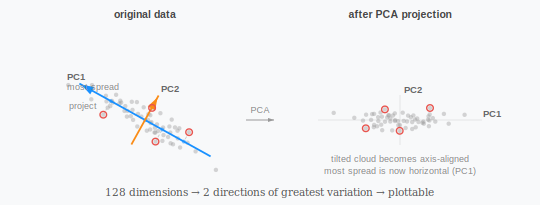

The error then passes through the ReLU gate. In the scalar case, $\text{ReLU}'(z_1) = 1$ because $z_1 = 1.0 > 0$, and the gradient passed through unchanged. In the digit classifier, ReLU applies to 128 neurons independently:

$$\delta_1 = \frac{\partial L}{\partial h} \odot \text{ReLU}'(z_1) = \underbrace{\begin{bmatrix} \partial L / \partial h_1 \\ \partial L / \partial h_2 \\ \vdots \end{bmatrix}}_{128 \times 1} \odot \underbrace{\begin{bmatrix} 1 \\ 0 \\ \vdots \end{bmatrix}}_{128 \times 1} = \underbrace{\begin{bmatrix} \partial L / \partial h_1 \\ 0 \\ \vdots \end{bmatrix}}_{128 \times 1}$$

The symbol $\odot$ means element-wise multiplication. $\text{ReLU}'(z_1)$ is a vector of 1s and 0s: 1 where the neuron was active during the forward pass, 0 where it was off. Active neurons pass their error through. Dead neurons block it. Same gate as the scalar case, applied 128 times in parallel.

Finally, the gradient for $W_1$ and $b_1$ follows the same pattern as $W_2$. Error times input, using an outer product:

$$\frac{\partial L}{\partial W_1} = x \cdot \delta_1^T = \underbrace{\begin{bmatrix} x_1 \\ x_2 \\ \vdots \\ x_{784} \end{bmatrix}}_{784 \times 1} \underbrace{\begin{bmatrix} \delta_1^{(1)} & \delta_1^{(2)} & \cdots & \delta_1^{(128)} \end{bmatrix}}_{1 \times 128} = \underbrace{(784 \times 128)}_{\text{same shape as } W_1}$$

$$\frac{\partial L}{\partial b_1} = \delta_1 \quad (128 \times 1)$$

That's the full backward pass. We now have gradients for all 101,770 parameters, each telling us how much nudging that parameter would change the loss. The scalar example had four gradients computed by four chain-rule multiplications. The vector version has 101,770 gradients, but the same four operations repeated at each layer.

Look back at what we did. At every layer, exactly four things happened. First, the error passed through the ReLU gate: $\delta = \text{error from above} \odot \text{ReLU}'(z)$, where active neurons pass the error and dead neurons block it. Second, the weight gradient was computed as an outer product of the input and the error: $\frac{\partial L}{\partial W} = \text{input to this layer} \cdot \delta^T$, so every entry is error times activation, the same formula as the scalar case. Third, the bias gradient equaled the error itself: $\frac{\partial L}{\partial b} = \delta$. Fourth, the error flowed backward through the weight matrix: $\frac{\partial L}{\partial \text{input}} = W \cdot \delta$, where the matrix without the transpose used in the forward pass reverses the direction.

That's all any layer ever does. You could have 50 layers and the backward pass would be a loop applying these four operations at each one. The network's depth doesn't change the algorithm; it changes how many times you repeat it. This is why frameworks like PyTorch can compute gradients automatically on any architecture: each operation knows its own local derivative, and the chain rule stitches them together.

For the intuition, imagine the loss is too high because the model predicted 30% for digit 7 when it should have predicted near 100%. Backpropagation traces backward: which output weights made the 7-score too low? Which hidden neurons fed those weights? Which input weights controlled those hidden neurons? Every weight gets a tweak proportional to how much it contributed to the mistake. Weights that had nothing to do with the error (because their neurons were inactive, or they connected to irrelevant outputs) get small or zero gradients. The network doesn't change everywhere at once; it changes most where the mistake originated.

But one correction isn't enough. The first update fixes one batch's mistakes and might introduce new ones; the network needs to see the data again and again, each time refining the weights a little further.


## The Training Loop

One pass through the entire training set is called an **epoch**. Most models need many epochs (10 to 100 or more) before the weights settle into good values. Within each epoch, we iterate over mini-batches, updating the weights after each batch.

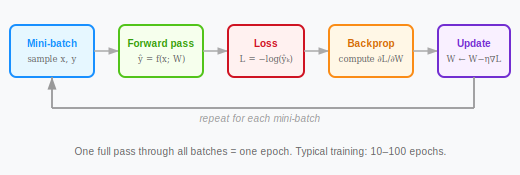

The learning rate $\eta$ is the most important **hyperparameter**: a setting you choose before training, as opposed to the weights, which are learned *during* training. Too large and the updates overshoot, causing the loss to bounce or diverge; too small and training takes forever.

**Weight initialization** is important too. If all weights start at 0, every neuron computes the same thing, every gradient is identical, and gradient descent will do nothing: all neurons stay identical forever. Instead, we initialize weights to small random values; the specifics of how to sample those values are the subject of careful research [@glorot2010understanding], but the main thing to take away is: start random, not zero.

Each pass through the loop tweaks the decision boundary closer to the right shape:

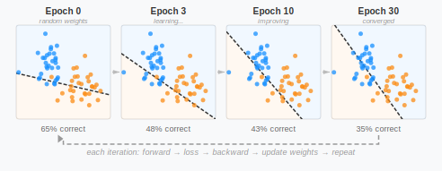

This loop is the same whether you're training a digit classifier with 100,000 weights or a language model with 100 billion. The architectures and loss functions might change, but the loop doesn't. Every model we build in the rest of this book (word embeddings in Chapter 3, transformers in Chapter 4) follows these exact mechanics. That's enough theory. Let's build one.


## Hands-On: A Neural Network in NumPy

We've spent the chapter building up the theory piece by piece: gradient descent, backpropagation, activation functions, the forward pass. Now let's put all of it into code. We'll build two models from scratch, a linear classifier and a neural network, train them on the same data with the same loop, and see exactly where the hidden layer makes the difference.

Set up your project:

```bash
mkdir chapter2
cd chapter2
uv init
uv add numpy matplotlib scikit-learn
```

Create a file called `network.py`. We start the same way we did in Chapter 1, loading and splitting MNIST:

```python
# network.py
from sklearn.datasets import fetch_openml
import numpy as np
import matplotlib.pyplot as plt

mnist = fetch_openml("mnist_784", version=1, as_frame=False, parser="auto")
X = mnist.data / 255.0
y = mnist.target.astype(int)
```

One difference from Chapter 1: we divide pixel values by 255, scaling them from the range $[0, 255]$ to $[0, 1]$. Neural networks train better when inputs are small numbers. Large input values produce large dot products, which push activations into their flat regions where gradients vanish. Scaling to $[0, 1]$ keeps everything in a reasonable range. This is called **feature scaling**, and it's standard practice.

```python
# network.py
# ...existing code above

rng = np.random.default_rng(42)
indices = rng.permutation(len(X))
X, y = X[indices], y[indices]

split = int(0.8 * len(X))
X_train, X_test = X[:split], X[split:]
y_train, y_test = y[:split], y[split:]

print(f"Training: {len(X_train)}, Test: {len(X_test)}")
```

In the theory, we defined cross-entropy loss as $L = -\sum_{i} y_i \log(\hat{y}_i)$, where $y$ is a **one-hot vector**: all zeros except for a 1 at the correct class. The label "3" becomes `[0, 0, 0, 1, 0, 0, 0, 0, 0, 0]`. We need to convert our integer labels into that form:

```python
# network.py
# ...existing code above

def one_hot(labels, num_classes=10):
    result = np.zeros((len(labels), num_classes))
    for i, label in enumerate(labels):
        result[i, label] = 1.0
    return result

y_train_oh = one_hot(y_train)
y_test_oh = one_hot(y_test)
```

`np.zeros` creates an array of all zeros. For each image, we set a single position to 1.0. The result is a matrix with 56,000 rows and 10 columns: each row is mostly zeros with one 1.

Now the activation functions from the theory. ReLU was $\text{ReLU}(z) = \max(0, z)$: pass positive values through, zero out negatives. In NumPy that's one line:

```python
# network.py
# ...existing code above

def relu(z):
    return np.maximum(0, z)
```

`np.maximum(0, z)` compares each element to 0 and keeps the larger one. We also need its derivative for backpropagation. In the theory, the ReLU gate passes the gradient where the neuron was active ($z > 0$) and blocks it where the neuron was off ($z \leq 0$). That's a vector of 1s and 0s:

```python
# network.py
# ...existing code above

def relu_derivative(z):
    return (z > 0).astype(float)
```

A boolean trick: `z > 0` produces `True` where positive and `False` where not, and `.astype(float)` converts those to 1.0 and 0.0. This is the exact gate we traced through in the scalar example, where $\text{ReLU}'(1.0) = 1$ because $z_1$ was positive.

For the output, we need softmax: $\text{softmax}(z)_i = e^{z_i} / \sum_j e^{z_j}$, which turns 10 raw scores into 10 probabilities that sum to 1. The code needs one extra trick the theory didn't mention:

```python
# network.py
# ...existing code above

def softmax(z):
    shifted = z - z.max(axis=1, keepdims=True)
    exp_z = np.exp(shifted)
    return exp_z / exp_z.sum(axis=1, keepdims=True)
```

We subtract the maximum value before exponentiating. This doesn't change the result (the subtracted constant cancels between numerator and denominator) but prevents $e^{z_i}$ from overflowing when $z_i$ is large. The `axis=1` means "operate across columns within each row," so each image in a batch gets its own maximum. The `keepdims=True` preserves the shape for broadcasting, the same mechanism Chapter 1 used when we divided arrays element-wise.

And the cross-entropy loss. In the theory: $L = -\log(\hat{y}_k)$, where $k$ is the correct class. We wrote this as $L = -\sum_i y_i \log(\hat{y}_i)$ using the one-hot vector, which zeroes out every term except the correct class. In NumPy, averaged over a batch:

```python
# network.py
# ...existing code above

def cross_entropy_loss(y_hat, y_true):
    y_hat_clipped = np.clip(y_hat, 1e-12, 1.0)
    return -np.mean(np.sum(y_true * np.log(y_hat_clipped), axis=1))
```

`np.clip` ensures no value is exactly 0 before we take the log (since $\log(0)$ is negative infinity). The `y_true * np.log(...)` multiplies element-wise; since `y_true` is one-hot, only the correct class contributes. `.sum(axis=1)` gives one loss per image, and `np.mean` averages over the batch.

That's all the building blocks. Now let's use them.

In the theory, we said a single perceptron draws a hyperplane through the input space, and 10 perceptrons (one per digit) form a linear classifier. Let's build that first: input (784) straight to softmax (10), no hidden layer. Each perceptron has 784 weights (one per pixel) and one bias. We stack all 10 weight vectors into a single matrix:

```python
# network.py
# ...existing code above

W_lin = rng.normal(0, 0.01, size=(784, 10))
b_lin = np.zeros(10)
```

`rng.normal(0, 0.01, size=(784, 10))` draws 7,840 random numbers from a normal distribution with mean 0 and standard deviation 0.01. Small random values: enough to break symmetry, not so large that they push softmax into weird territory. The biases start at zero.

The optimization loop from the theory had three steps that repeat: forward pass (make predictions), backward pass (compute gradients), update (adjust weights). We also said that in practice we use mini-batches instead of the full training set, because the gradient from a random subset is an unbiased estimate of the full gradient but much cheaper to compute. Here's that loop:

```python
# network.py
# ...existing code above

epochs = 30
batch_size = 64
lr = 0.1

for epoch in range(epochs):
    perm = rng.permutation(len(X_train))
    X_shuffled = X_train[perm]
    y_shuffled = y_train_oh[perm]

    for start in range(0, len(X_train), batch_size):
        X_batch = X_shuffled[start:start + batch_size]
        y_batch = y_shuffled[start:start + batch_size]

        # Forward
        z = X_batch @ W_lin + b_lin
        y_hat = softmax(z)

        # Backward
        delta = (y_hat - y_batch) / len(X_batch)
        dW = X_batch.T @ delta
        db = delta.sum(axis=0)

        # Update
        W_lin -= lr * dW
        b_lin -= lr * db
```

Each epoch shuffles the training data (so batches are different every time), then iterates through 64-image mini-batches. The forward pass computes $z = W^T x + b$ for all 64 images at once (`X_batch @ W_lin + b_lin`), and `softmax` turns the scores into probabilities.

The gradient `y_hat - y_batch` is the cross-entropy + softmax derivative we derived in the backpropagation section: prediction minus target, the same $\delta = \hat{y} - y$. `X_batch.T @ delta` is the weight gradient: in the theory, we computed this as an outer product of the input and the error. Here the matrix multiply does 64 outer products and sums them in one operation. And `W_lin -= lr * dW` is gradient descent: $w \leftarrow w - \eta \nabla L$.

```python
# network.py
# ...existing code above

preds_lin = (X_test @ W_lin + b_lin).argmax(axis=1)
acc_lin = (preds_lin == y_test).sum() / len(y_test)
print(f"Linear classifier accuracy: {acc_lin:.1%}")
```

You should see about 92%. Better than the template matcher's 81%, but far from perfect.

Let's look at what this linear classifier actually learned. Each column of `W_lin` is a 784-dimensional weight vector for one digit class. We can reshape these into 28×28 images:

```python
# network.py
# ...existing code above

fig, axes = plt.subplots(1, 10, figsize=(15, 2))
for digit, ax in enumerate(axes):
    ax.imshow(W_lin[:, digit].reshape(28, 28), cmap="RdBu_r", vmin=-0.5, vmax=0.5)
    ax.set_title(str(digit), fontsize=12)
    ax.axis("off")
plt.suptitle("What the linear classifier looks for", fontsize=14)
plt.tight_layout()
plt.savefig("linear_weights.png", dpi=150)
plt.show()
```

Blue regions are pixels whose brightness makes the model more confident in that digit; red regions are pixels that make it less confident. Compare these to the template matcher's blurry averages from Chapter 1. These are sharper: gradient descent didn't just average, it learned *which pixels discriminate*. But they're still global patterns over the full image. The linear model can't learn "there's a loop" or "two lines meet at an angle," because those are spatial relationships that require combining pixels nonlinearly, not just weighting individual ones.

Now we add a hidden layer and make it a **neural network**. The architecture becomes 784 -> 128 -> 10. In the theory, we said all weights should start as small random values (not zero, because then every neuron computes the same thing and gradient descent can't break the symmetry). We'll use He initialization [@he2015delving], which scales the random values by $\sqrt{2 / n_\text{in}}$:

```python
# network.py
# ...existing code above

def initialize_weights(rng):
    W1 = rng.normal(0, np.sqrt(2.0 / 784), size=(784, 128))
    b1 = np.zeros(128)
    W2 = rng.normal(0, np.sqrt(2.0 / 128), size=(128, 10))
    b2 = np.zeros(10)
    return W1, b1, W2, b2

W1, b1, W2, b2 = initialize_weights(rng)
print(f"Total parameters: {W1.size + b1.size + W2.size + b2.size}")
```

Why $\sqrt{2 / n_\text{in}}$? Each neuron sums $n_\text{in}$ weighted inputs. If the weights aren't scaled down, the output variance grows by a factor of $n_\text{in}$ at every layer and activations explode before training starts. Setting the weight variance to $2/n_\text{in}$ cancels that growth (the 2 accounts for ReLU zeroing out half the outputs). About 101,770 parameters, thirteen times more than the linear classifier's 7,840, and every one is adjustable.

In the theory, the forward pass was $x \to W_1^T x + b_1 \to \text{ReLU} \to W_2^T h + b_2 \to \text{softmax}$: two matrix multiplies with a ReLU in between. Here's that in NumPy:

```python
# network.py
# ...existing code above

def forward(X, W1, b1, W2, b2):
    z1 = X @ W1 + b1            # (batch, 784) @ (784, 128) = (batch, 128)
    h = relu(z1)                 # (batch, 128)
    z2 = h @ W2 + b2            # (batch, 128) @ (128, 10) = (batch, 10)
    y_hat = softmax(z2)          # (batch, 10)
    return z1, h, z2, y_hat
```

One thing to notice: we write `X @ W1` rather than `W1.T @ X`. In the theory, we wrote $W_1^T x$ because $x$ was a column vector and the matrix had to go on the left. Here our images are stored as rows: `X` has shape `(batch, 784)`, so `X @ W1` gives `(batch, 784) @ (784, 128) = (batch, 128)`. Same 128 dot products per image, written to match NumPy's row-major convention. We return the intermediate values `z1` and `h` because backpropagation needs them, as we'll see next.

Now the backward pass. In the theory, we traced four operations at each layer: compute the output error, compute the weight gradient as an outer product, pass the error backward through the weight matrix, and apply the ReLU gate. Here's all of that in one function:

```python
# network.py
# ...existing code above

def backward(X, z1, h, y_hat, y_true, W2):
    batch_size = X.shape[0]
    delta2 = (y_hat - y_true) / batch_size    # (batch, 10)

    dW2 = h.T @ delta2         # (128, batch) @ (batch, 10) = (128, 10)
    db2 = delta2.sum(axis=0)   # (10,)

    delta1 = (delta2 @ W2.T) * relu_derivative(z1)  # (batch, 128)

    dW1 = X.T @ delta1         # (784, batch) @ (batch, 128) = (784, 128)
    db1 = delta1.sum(axis=0)   # (128,)

    return dW1, db1, dW2, db2
```

Let's connect each line back to the theory.

`delta2 = y_hat - y_true` is the output error $\delta_2 = \hat{y} - y$: prediction minus target, one error per class per image. In the scalar example this was a single number ($-2.6$). Here it's a matrix with 64 rows (one per image in the batch) and 10 columns (one per class).

`h.T @ delta2` is the weight gradient for $W_2$. In the theory, we wrote $\nabla W_2 = h \cdot \delta_2^T$ as an outer product of two column vectors, giving a $(128 \times 10)$ matrix where each entry is "activation of hidden neuron $j$ times error at output $i$." In code, `h` and `delta2` each have a batch dimension (64 images), so the transpose goes on `h` instead: `(128, batch) @ (batch, 10) = (128, 10)`. The matrix multiply sums over the batch, giving us the average gradient across all 64 images. Same result, different route through the shapes.

`delta2 @ W2.T` propagates the error backward. In the theory, $W_2 \cdot \delta_2$ multiplied $(128 \times 10)$ by $(10 \times 1)$ to carry 10 errors back to 128 neurons. In code, the batch dimension comes first, so we write `delta2 @ W2.T`: `(batch, 10) @ (10, 128) = (batch, 128)`. The `.T` on `W2` reverses the connections: during the forward pass, `W2` mapped 128 hidden values to 10 outputs; now `W2.T` maps 10 errors back to 128 neurons.

`* relu_derivative(z1)` is the ReLU gate. A matrix of 1s and 0s, one per neuron per image, that blocks the gradient where the neuron was inactive during the forward pass. In the scalar example, this was multiplying by 1 (because $z_1 = 1.0 > 0$). Here it applies to all 128 neurons for all 64 images at once.

`.sum(axis=0)` for the bias gradients adds up contributions from every image in the batch. In the theory, the bias gradient was the error itself, $\nabla b = \delta$. With a batch, each image contributes its own error vector, and the sum gives the total gradient.

Finally, the update step. In the theory: $w \leftarrow w - \eta \nabla L$. In code:

```python
# network.py
# ...existing code above

def update_weights(W1, b1, W2, b2, dW1, db1, dW2, db2, lr):
    W1 -= lr * dW1
    b1 -= lr * db1
    W2 -= lr * dW2
    b2 -= lr * db2
    return W1, b1, W2, b2
```

Now the training loop. Same structure as the linear classifier, but calling our `forward`, `backward`, and `update_weights` functions:

```python
# network.py
# ...existing code above

epochs = 30
batch_size = 64
lr = 0.1
losses = []

for epoch in range(epochs):
    perm = rng.permutation(len(X_train))
    X_shuffled = X_train[perm]
    y_shuffled = y_train_oh[perm]

    epoch_loss = 0.0
    num_batches = 0

    for start in range(0, len(X_train), batch_size):
        end = start + batch_size
        X_batch = X_shuffled[start:end]
        y_batch = y_shuffled[start:end]

        z1, h, z2, y_hat = forward(X_batch, W1, b1, W2, b2)
        loss = cross_entropy_loss(y_hat, y_batch)
        epoch_loss += loss
        num_batches += 1

        dW1, db1, dW2, db2 = backward(X_batch, z1, h, y_hat, y_batch, W2)
        W1, b1, W2, b2 = update_weights(W1, b1, W2, b2, dW1, db1, dW2, db2, lr)

    avg_loss = epoch_loss / num_batches
    losses.append(avg_loss)

    if (epoch + 1) % 5 == 0 or epoch == 0:
        print(f"Epoch {epoch+1:3d} | Loss: {avg_loss:.4f}")
```

The loss starts around 2.3, which is $-\log(1/10)$: the loss when the model assigns equal 10% probability to every class, essentially guessing randomly. Watch it drop:

```python
# network.py
# ...existing code above

plt.figure(figsize=(8, 4))
plt.plot(range(1, epochs + 1), losses)
plt.xlabel("Epoch")
plt.ylabel("Cross-Entropy Loss")
plt.title("Training loss over time")
plt.grid(True, alpha=0.3)
plt.tight_layout()
plt.savefig("loss_curve.png", dpi=150)
plt.show()
```

The curve drops steeply in the first few epochs and then levels off: fast initial progress as the network learns the obvious patterns, then diminishing returns as it refines subtle ones.

Now the comparison we've been building toward:

```python
# network.py
# ...existing code above

def predict(X, W1, b1, W2, b2):
    _, _, _, y_hat = forward(X, W1, b1, W2, b2)
    return y_hat.argmax(axis=1)

test_preds = predict(X_test, W1, b1, W2, b2)
accuracy = (test_preds == y_test).sum() / len(y_test)
print(f"\nLinear classifier: {acc_lin:.1%}")
print(f"Neural network:    {accuracy:.1%}")
```

You should see about 97% for the neural network versus 92% for the linear classifier. Same data, same loss function, same gradient descent. The only difference is the hidden layer.

In Chapter 1, we introduced the generalization gap: the difference between training accuracy and test accuracy. Let's check it here:

```python
# network.py
# ...existing code above

train_preds = predict(X_train, W1, b1, W2, b2)
train_accuracy = (train_preds == y_train).sum() / len(y_train)
print(f"\nTraining accuracy: {train_accuracy:.1%}")
print(f"Test accuracy:     {accuracy:.1%}")
print(f"Gap:               {train_accuracy - accuracy:.1%}")
```

Training accuracy should be higher (close to 100% versus about 98% on test). A gap of about 2% means the model generalized well, though it has memorized the training data almost perfectly.

A 2% gap is small here, but on harder problems or smaller datasets it can be much larger. The train/test split tells you overfitting is happening, but it doesn't fix it. The standard fix is **regularization**: adding a penalty to the loss that discourages the model from fitting noise. The most common version adds the sum of squared weights to the loss, which pushes the network toward smaller, smoother boundaries that are less likely to contort around individual training examples. We won't implement it in this chapter, but it's worth knowing that diagnosing overfitting and treating it are different things.

In the theory, we proved that stacking linear layers without activation functions collapses into a single linear transformation: a linear function of a linear function is still linear. Let's verify. We'll train a network with the same 784 -> 128 -> 10 architecture, but replace ReLU with the identity function (no activation at all):

```python
# network.py
# ...existing code above

def forward_no_relu(X, W1, b1, W2, b2):
    z1 = X @ W1 + b1
    h = z1                       # no activation!
    z2 = h @ W2 + b2
    y_hat = softmax(z2)
    return z1, h, z2, y_hat
```

The backward pass is the same, minus the ReLU gate:

```python
# network.py
# ...existing code above

def backward_no_relu(X, z1, h, y_hat, y_true, W2):
    batch_size = X.shape[0]
    delta2 = (y_hat - y_true) / batch_size
    dW2 = h.T @ delta2
    db2 = delta2.sum(axis=0)
    delta1 = delta2 @ W2.T       # no ReLU gate
    dW1 = X.T @ delta1
    db1 = delta1.sum(axis=0)
    return dW1, db1, dW2, db2
```

Now train it:

```python
# network.py
# ...existing code above

W1_nr, b1_nr, W2_nr, b2_nr = initialize_weights(np.random.default_rng(42))

for epoch in range(30):
    perm = rng.permutation(len(X_train))
    X_shuffled = X_train[perm]
    y_shuffled = y_train_oh[perm]

    for start in range(0, len(X_train), batch_size):
        end = start + batch_size
        X_batch = X_shuffled[start:end]
        y_batch = y_shuffled[start:end]

        z1, h, z2, y_hat = forward_no_relu(X_batch, W1_nr, b1_nr, W2_nr, b2_nr)
        dW1, db1, dW2, db2 = backward_no_relu(
            X_batch, z1, h, y_hat, y_batch, W2_nr
        )
        W1_nr, b1_nr, W2_nr, b2_nr = update_weights(
            W1_nr, b1_nr, W2_nr, b2_nr, dW1, db1, dW2, db2, lr)

preds_nr = forward_no_relu(X_test, W1_nr, b1_nr, W2_nr, b2_nr)[3].argmax(axis=1)
acc_nr = (preds_nr == y_test).sum() / len(y_test)
print(f"\nLinear classifier (no hidden layer): {acc_lin:.1%}")
print(f"Two layers, no ReLU:                 {acc_nr:.1%}")
print(f"Neural network (with ReLU):          {accuracy:.1%}")
```

The two-layer model without ReLU gets about 92%, the same as the linear classifier. 101,770 parameters, and it can't do any better than 7,850, because without the nonlinearity the two matrices $W_1$ and $W_2$ multiply into one: $X W_1 W_2 = X W_\text{combined}$. The extra layer bought nothing. The hidden layer only helps when ReLU is there to fold the space.

Now let's see what the hidden layer actually learned. In the theory, we said the hidden layer transforms the data into a new space where digits that overlap in pixel coordinates end up in separate regions. Let's look. We'll run the test set through the first layer to get 128-dimensional hidden representations, then project them to 2D so we can plot them.

128 dimensions is too many to visualize directly. **Principal component analysis** (PCA) gets us down to 2 by finding the directions along which the data varies the most, then projecting onto those directions.

Think about a cloud of points shaped like a cigar. Most of the spread is along the cigar's length. A little spread is along its width. Almost none is along its thickness. If you had to flatten this cloud to 2D, you'd pick the length and the width: the two directions that preserve the most information about where each point sits relative to the others. That's what PCA does.


The algorithm works in three steps. First, center the data by subtracting the mean so the cloud sits at the origin. Second, compute the **covariance matrix**: a table where entry $(i, j)$ tells you how much dimensions $i$ and $j$ vary together. If two dimensions rise and fall in sync across the data, their covariance is large; if they're unrelated, it's near zero. Third, find the **eigenvectors** of that matrix. Each eigenvector is a direction in the original space, and its eigenvalue tells you how much variance lies along that direction. The eigenvector with the largest eigenvalue is the cigar's length. The next largest is its width. To project to 2D, multiply each data point by the top two eigenvectors:

```python
# network.py
# ...existing code above

def pca_2d(vecs):
    centered = vecs - vecs.mean(axis=0)
    cov = np.cov(centered, rowvar=False)
    eigenvalues, eigenvectors = np.linalg.eigh(cov)
    top2 = eigenvectors[:, -2:][:, ::-1]
    return centered @ top2
```

`np.cov` computes the covariance matrix. `np.linalg.eigh` returns eigenvalues sorted smallest to largest, so `[:, -2:]` grabs the last two columns (the two largest) and `[:, ::-1]` flips them so the largest comes first. The final `centered @ top2` projects every 128-dimensional point onto these two directions, giving us an $(N, 2)$ array we can plot.

Now we project both the raw pixels and the hidden representations side by side. First the data:

```python
# network.py
# ...existing code above

sample_idx = rng.choice(len(X_test), 3000, replace=False)
X_sample = X_test[sample_idx]
y_sample = y_test[sample_idx]

z1_sample = X_sample @ W1 + b1
h_sample = relu(z1_sample)

pixel_2d = pca_2d(X_sample)
hidden_2d = pca_2d(h_sample)
```

Then the plot:

```python
# network.py
# ...existing code above

fig, (ax1, ax2) = plt.subplots(1, 2, figsize=(16, 7))
colors = plt.cm.tab10(np.linspace(0, 1, 10))

for digit in range(10):
    mask = (y_sample == digit)
    ax1.scatter(pixel_2d[mask, 0], pixel_2d[mask, 1],
                c=[colors[digit]], s=5, alpha=0.5, label=str(digit))
    ax2.scatter(hidden_2d[mask, 0], hidden_2d[mask, 1],
                c=[colors[digit]], s=5, alpha=0.5, label=str(digit))

ax1.set_title("Raw pixels (PCA to 2D)", fontsize=14)
ax1.legend(markerscale=3, fontsize=9)
ax1.grid(True, alpha=0.3)

ax2.set_title("After hidden layer (PCA to 2D)", fontsize=14)
ax2.legend(markerscale=3, fontsize=9)
ax2.grid(True, alpha=0.3)

plt.tight_layout()
plt.savefig("representations.png", dpi=150)
plt.show()
```

In the left panel, the raw pixel representations are a tangle: digits overlap, 4s and 9s bleed into each other, 3s and 5s and 8s form one messy region. No straight line can sort this out, which is why the linear classifier tops out at 92%.

In the right panel, after the hidden layer, the same digits are pulled into tighter, more separated clusters. The network learned a transformation that moves 4s away from 9s and pulls 3s away from 8s. The output layer's job (drawing hyperplanes) is now easier because the hidden layer already did the hard work. This is exactly what we predicted: the hidden layer warps the space to make the data linearly separable.

Let's also build the confusion matrix to see which specific confusions improved:

```python
# network.py
# ...existing code above

def confusion_matrix(y_true, y_pred):
    matrix = np.zeros((10, 10), dtype=int)
    for true, pred in zip(y_true, y_pred):
        matrix[true][pred] += 1
    return matrix

confusion = confusion_matrix(y_test, test_preds)
```

And plot it:

```python
# network.py
# ...existing code above

fig, ax = plt.subplots(figsize=(8, 8))
im = ax.imshow(confusion, cmap="Blues")
ax.set_xlabel("Predicted", fontsize=12)
ax.set_ylabel("Actual", fontsize=12)
ax.set_title("Neural network confusion matrix", fontsize=14)
ax.set_xticks(range(10))
ax.set_yticks(range(10))
for i in range(10):
    for j in range(10):
        color = "white" if confusion[i, j] > confusion.max() / 2 else "black"
        ax.text(j, i, str(confusion[i, j]),
                ha="center", va="center", color=color, fontsize=9)
plt.colorbar(im, ax=ax, shrink=0.8)
plt.tight_layout()
plt.savefig("nn_confusion.png", dpi=150)
plt.show()
```

Compare this to the template matcher's confusion matrix from Chapter 1. The same digit pairs that were hard before (4/9, 3/8, 3/5) are still the most confused, but the error counts are much lower. The network learned to distinguish them, though not perfectly.

Finally, let's look at the actual mistakes:

```python
# network.py
# ...existing code above

wrong = np.where(test_preds != y_test)[0]
fig, axes = plt.subplots(2, 8, figsize=(12, 3))
for i, ax in enumerate(axes.flat):
    idx = wrong[i]
    ax.imshow(X_test[idx].reshape(28, 28), cmap="gray")
    ax.set_title(f"{test_preds[idx]}(={y_test[idx]})", fontsize=10)
    ax.axis("off")
plt.suptitle("Wrong predictions (predicted = actual)", fontsize=13)
plt.tight_layout()
plt.savefig("errors.png", dpi=150)
plt.show()
```

`np.where(condition)` returns the indices where the condition is true: every position where our prediction doesn't match the label. Look at these images. Many are genuinely ambiguous: a 4 that could be a 9, an 8 that could be a 3. The network's remaining mistakes are often the same ones a human would hesitate over.

That's a complete neural network in about 150 lines of NumPy. We went from a template matcher (81%) to a linear classifier (92%) to a neural network (97%), and we can see exactly why each step improved: the linear classifier optimized its boundaries instead of averaging, and the neural network added a hidden layer that warps the space to untangle the digits before drawing those boundaries. We also proved that the nonlinearity is what matters: remove ReLU, and the extra layer does nothing.

The same training loop (forward, loss, backward, update) will reappear in every chapter from here on. In Chapter 3, we'll face a different problem: images came with pixel values built in, but how do you turn words into numbers that a neural network can learn from?

## Chapter Summary

- The optimization loop repeats: forward pass (make predictions), compute loss (measure error), backward pass (compute gradients), update weights (reduce error)
- Gradient descent adjusts weights in the direction that reduces the loss, scaled by a learning rate $\eta$. Too large and it overshoots, too small and it crawls
- A perceptron computes a weighted sum plus bias, passed through an activation function: $\hat{y} = \sigma(\mathbf{w} \cdot \mathbf{x} + b)$, which geometrically draws a hyperplane through the input space
- A linear classifier (perceptrons without a hidden layer) gets 92% on MNIST. Better than templates, but it can only draw straight boundaries through pixel space
- Activation functions (sigmoid, ReLU) introduce nonlinearity. Without them, stacking layers collapses into a single linear transformation, and you never escape the limits of straight boundaries
- The hidden layer warps the input space so that tangled classes become separable, then the output layer draws simple boundaries in the new space
- Backpropagation uses the chain rule to compute gradients layer by layer from output to input, telling each weight how to change
- The universal approximation theorem guarantees that a wide enough network can represent any continuous function, but representation is not the same as learnability

In the next chapter, we tackle text: how to turn words into numbers that preserve meaning, so that neural networks have something useful to learn from.

## Exercises

1. Our network uses a learning rate of 0.1. Try training with 0.001, 0.01, 0.1, 0.5, and 1.0. Plot the loss curves for all five on the same graph. Which learning rates converge? Which diverge? We walked through the math of overshooting in the gradient descent section; you should see exactly that effect at the larger values. What happens to test accuracy at each learning rate? Is the fastest-converging learning rate also the one that gives the best final accuracy?

2. We used one hidden layer of 128 neurons. Try 32, 64, 128, 256, and 512, keeping everything else fixed. Plot test accuracy versus hidden layer size. Does accuracy keep improving, or does it plateau? Now plot training accuracy alongside test accuracy for each size. The gap between the two tells you how much the model overfits. Does the pattern match what Chapter 1 predicted about underfitting versus overfitting? Which size gives the best test accuracy, and is it the largest?

3. Add a **second hidden layer**. Your architecture becomes 784 -> 128 -> 64 -> 10 (two hidden layers with ReLU, one output layer with softmax). You'll need a third weight matrix and bias vector, and the forward and backward passes each get one more step. Does the deeper network beat the single-hidden-layer version? Run the PCA visualization on the output of each hidden layer separately. The first layer transforms raw pixels; the second transforms the first layer's output. Do the digit clusters get progressively cleaner from layer to layer?

4. Verify that backpropagation is correct by implementing **numerical gradient checking**. For a single weight $w$, approximate its gradient with:

    $$\frac{\partial L}{\partial w} \approx \frac{L(w + \epsilon) - L(w - \epsilon)}{2\epsilon}$$

    Pick a small batch, set $\epsilon = 10^{-5}$, and compare the numerical gradient to the analytical one from backpropagation for a handful of random weights in $W_1$ and $W_2$. They should agree to at least 5 decimal places. This is slow (two forward passes per weight), so only check a few, but it's the standard way to verify that your gradient code is correct. Now deliberately introduce a bug in your backward function (e.g., remove the ReLU derivative mask) and run the check again. How large is the discrepancy?

5. Visualize what individual hidden neurons respond to. For each of the 128 hidden neurons, find the 10 test images that produce the highest activation at that neuron (the value in $h$ after ReLU). Pick 8 neurons with interesting patterns and plot their top-10 images in a grid. Do neurons specialize? Can you find one that fires on loops, one that fires on vertical strokes, one that responds to a specific part of the image? Now look at a neuron that fires on many different-looking digits. What visual feature might those digits share that isn't obvious at first glance?

6. The hands-on proved that removing ReLU collapses two linear layers into one. Try the reverse: what if the hidden layer uses ReLU but you make it very small, say 2 neurons instead of 128? Train a 784 -> 2 -> 10 network. Accuracy will be poor, but now you can skip PCA entirely: the hidden representation *is* 2D. Plot the hidden activations directly, colored by digit. You're looking at the network's entire internal representation of the data. Which digits can it still separate with only 2 dimensions? Which ones overlap? Gradually increase the bottleneck (2, 4, 8, 16, 32, 64, 128) and plot test accuracy versus hidden size. At what width does the network have enough room to untangle the digits?
